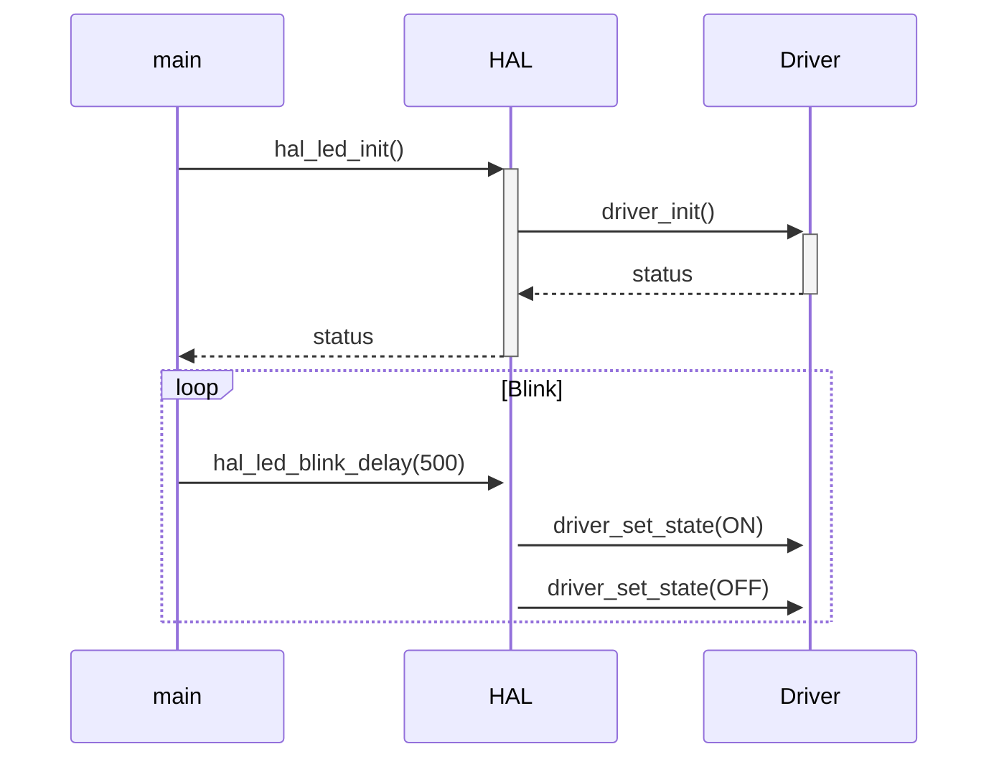

# Modular LED Blinker for Raspberry Pi Pico W

## Overview

This project demonstrates a modular implementation for controlling the built-in LED on the Raspberry Pi Pico W, following software engineering best practices for embedded systems. The structure organizes the code into three main layers:

1. **Driver** (direct hardware access)
2. **HAL** (hardware abstraction layer)
3. **Application** (main logic)

## Project Structure

```
pico-w-modular-blink/
├── app/
│   └── main.c            # Main application logic
├── drivers/
│   ├── led_embutido.c    # Driver implementation
│   └── led_embutido.h    # Driver interface
├── hal/
│   ├── hal_led.c         # HAL implementation
│   └── hal_led.h         # HAL interface
├── include/              # Public headers
└── CMakeLists.txt        # Build configuration
```

## Prerequisites

- [Raspberry Pi Pico W](https://www.raspberrypi.com/products/raspberry-pi-pico/)
- [ARM GNU Toolchain](https://developer.arm.com/tools-and-software/open-source-software/developer-tools/gnu-toolchain)
- [Pico SDK](https://github.com/raspberrypi/pico-sdk)
- [CMake](https://cmake.org/) (version 3.13+)

## How to Build

1. Clone the repository:
   ```bash
   git clone https://github.com/your-username/pico-w-modular-blink.git
   cd pico-w-modular-blink
   ```

2. Set up the environment:
   ```bash
   export PICO_SDK_PATH=/path/to/pico-sdk
   mkdir build
   cd build
   ```

3. Compile the project:
   ```bash
   cmake ..
   make -j4
   ```

4. The `struct_blink.uf2` file will be generated in the `build` folder - copy it to the Pico W in Mass Storage Device mode.

## Design Principles

### 1. Layered Architecture

| Layer         | Responsibility                           |
|---------------|------------------------------------------|
| **Application** | High-level logic                      |
| **HAL**       | Hardware abstraction                    |
| **Driver**    | Specific hardware control               |

### 2. Benefits

 **Portability**: Easily adaptable to other hardware  
 **Maintainability**: Organized and documented code  
 **Testability**: Isolated layers facilitate unit testing  
 **Reusability**: Components can be used in other projects  

## API Documentation

### HAL Layer

```c
// Initialization
int hal_led_init();

// Basic control
void hal_led_turn_on();
void hal_led_turn_off();
void hal_led_set_state(bool on);

// Utility functions
void hal_led_blink_delay(uint32_t ms);
bool hal_led_toggle();
```

## Control Flow



## Usage Examples

### 1. Blink LED in a loop
```c
hal_led_init();
while(1) {
    hal_led_blink_delay(250); // Blinks every 250ms
}
```

### 2. Manual control
```c
hal_led_init();
hal_led_turn_on();
sleep_ms(1000);
hal_led_turn_off();
```

## **System Behavior Images**
Below are screenshots and photos demonstrating the system in action:

### **The board during testing**  
  
_Photo of the BitDogLab board._

### **screenshot during testing using VSCode – compiling and running**  
  
_Screenshot of the program running within the VS Code environment._


## License

MIT License - See [LICENSE](LICENSE) file for details.

## How to Contribute

1. Fork the project
2. Create your branch (`git checkout -b feature/new-feature`)
3. Commit your changes (`git commit -m 'Add some feature'`)
4. Push to the branch (`git push origin feature/new-feature`)
5. Open a Pull Request


